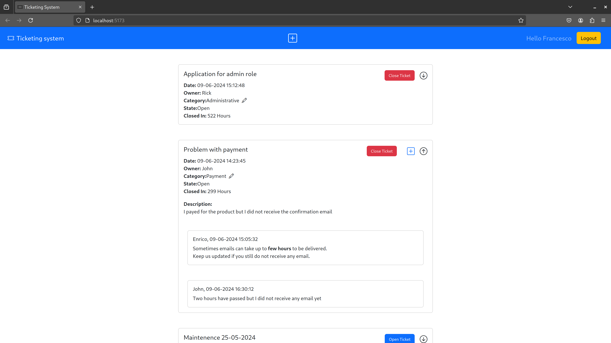
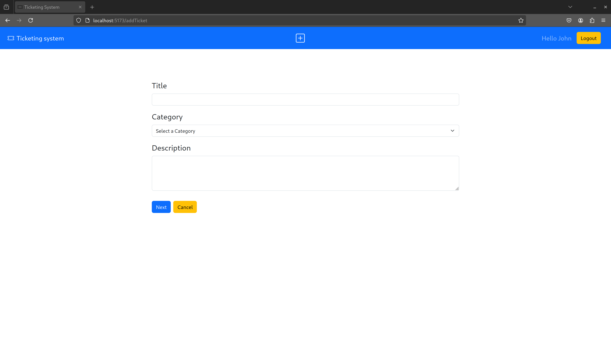

# React small project
## Overview
Refer to the ProjectPrompt.pdf for details on requirements

## React Client Application Routes

- Route `/`: Home page, shows the list of all tickets. Logged in users can also expand tickets for getting further information or edit ticket state and category depending on their permissions. Logged in users can navigate to the route ("/addTicket") to add a new ticket or to the route ("/addBlock/:ticketId") to add a new text block to opened tickets. Admin users can also see, for each open ticket, the prediction of the hours it will take to close the ticket. 

- Route `/login`: Login form, allow users to login. After successful login the user is redirected to the main route ("/")
- Route `/addTicket`: Form to allow the user the submission of a new ticket. A confirmation read-only page with the prediction of the time it will take to close the new ticket is shown before final submission.
- Route `/addBlock/:ticketId`: Form to allow the user the submission of a new text block for a specific ticket

## API Server

- **GET** `/api/tickets`: Get general info of all the tickets as a JSON list ordered from the newest to the oldest
  - **Response body**: On success, JSON object with the list of all tickets with their general information (no description). Otherwise description of the error

  ```
  [
      {
          "id": 5,
          "title": "Application for admin role",
          "category": "administrative",
          "state": "open",
          "owner": {
              "name": "Rick",
              "id": 5
          },
          "timestamp": "09-06-2024 15:12:48"
     },
      ...
  ]
  ```
  - Codes: `200 OK`, `500 Internal Server Error`  

- **GET** `/api/tickets/:ticketId`: Get every information about a ticket, including the text blocks associated to it. Only logged in user can perfom a request to this route
  - **Response body**: On success, JSON object with 2 properties: `ticket`, with all the info about the ticket including the description; `textBlocks`, a list of text blocks associated to that ticket, ordered from the oldest to the newest. Otherwise description of the error

	```
	{
	    "ticket": {
	        "id": 1,
	        "title": "Problem with payment",
	        "category": "payment",
	        "description": "I payed for the product but I did not receive the confirmation email",
	        "state": "open",
	        "timestamp": "09-06-2024 14:23:45",
	        "owner": {
	            "name": "John",
	            "role": "user",
	            "id": 4
	        }
	    },
	    "textBlocks": [
	        {
	            "id": 1,
	            "text": "Sometimes emails can take up to few hours to be delivered.\nKeep us updated if you still do not receive any email.",
	            "timestamp": "09-06-2024 15:05:32",
	            "author": {
	                "id": 2,
	                "name": "Enrico",
	                "role": "admin"
	            }
	        },
	        ...
	    ]
	}
	
	```
  - Codes: `200 OK`, `401 Unauthorized`, `404 Not Found`, `422 Unprocessable Unit`, `500 Internal Server Error`  

- **POST** `/api/tickets`: Create a new ticket for the logged in user
  - **Request**: A JSON object with title,category, and description
	```
	{ "title":"", "category":"payment", "description":"This ticket is a test ticket" }
	```
  - **Response body**: On success, a JSON with the ticket just created. Otherwise a JSON object with a the property errorMsg containing the description of the error. In case of validation errors errorMsg is a list.
	```
	{ "errorMsg": [ "field [title] in body: Invalid value " ] }
	```
  -Codes `201 Created`, `401 Unauthorized`,`422 Unprocessable Unit`(validation error), `500 Internal Server Error`

- **POST** `/api/tickets/:ticketId`: Create a new text block associated to the logged in user for the ticket identified with ticketId 
  - **Request body**: JSON object with `text` (description of the text block) and `id` of the ticket you want to associate your text block with that has to match the one in the URL.
	```
	{
	    "text":"this is an example of text block",
	    "id":2
	}  
	```
  - **Response body**: On success JSON object with the info of the text block just created, JSON object with errorMsg describing the error otherwise
	```
	{
	    "errorMsg": "This ticket is closed"
	}
	```

  - Codes `201 Created`, `400 Bad Request`(trying to create a textblock for a closed ticket), `401 Unauthorized`, `404 Not Found`, `422 Unprocessable Unit`(validation errors), `500 Internal Server Error`

- **PUT** `/api/tickets/:ticketId/category`: Update the category of a ticket. Only for logged in **admin** user.
  - **Request body**: JSON object containing the `category` to set and the `id` of the ticket to modify that has to match the one in the URL.
	```
	{
	    "category":"payment",
	    "id":1
	}
	```
  - **Response body**: On success, JSON object with `itemsChanged` proprety indicating the number of items modified. On error, JSON object with errorMsg property describying the error.
	```
	{
	    "errorMsg": "You are not authorized to perform this action"
	}
	```
  - Codes: `200 OK`, `401 Unauthorized`, `404 Not Found`, `422 Unprocessable Unit`, `500 Internal Server Error`


- **PUT** `/api/tickets/:ticketId/state`: Update the state of a ticket. Basic users can only close tickets and only if they own them, admin users can both close or open any ticket.
  - **Request body**: JSON object with `state` to set and `id` of the ticket to modify that has to match the one in the URL
	```
	{
	    "state":"closed",
	    "id":2
	}
	```
  - **Response body**: On success, JSON object with `itemsChanged` proprety indicating the number of items modified. On error, JSON object with errorMsg property describying the error.
	```
	{ "itemsChanged": 1 }
	```
  - Codes: `200 OK`, `401 Unauthorized`, `404 Not Found`, `422 Unprocessable Unit`, `500 Internal Server Error`

- **GET** `/api/auth-token`: Returns an auth token for the logged in user
  - **Response body**: JSON object with the token
  - **Token Payload**: Access level of the logged in user (admin or user) 
  - Codes: `200 OK`, `401 Unauthorized`

### Authentication APIs

- **POST** `/api/sessions`: Authenticate and login the user
  - **Request Body**: JSON object with `username` equal to email and `password`
	```
	{
	    "username":"john@test.com",
	    "password":"pwd"
	}
	```
  - **Response Body**: On success, JSON object with user's info. On error, JSON object describying the error
	```
	{
	    "id": 4,
	    "username": "john@test.com",
	    "name": "John",
	    "role": "user"
	}
	```
  - Codes: `200 OK`, `401 Unauthorized`(invalid credentials)

- **DELETE** `/api/sessions/current`: Logout the user
  - Codes: `200 OK`

- **GET** `/api/sessions/current`: Get infos about a logged in user if it has a valid cookie
  - **Response body**: JSON object with the user info if the user has a valid cookie, JSON object with error description otherwise
	```
	{
	    "id": 4,
	    "username": "john@test.com",
	    "name": "John",
	    "role": "user"
	}
	```
  - Codes: `200 OK`, `401 Unauthorized`

## API Server2

- **POST** `/api/closing-prediction`: Returns the prediction of the time required to close a ticket for each ticket of a list of requested tickets
  - **Request Headers**: JWT token with access level of the user 
  - **Request body**: JSON object with a `list of tickets`, each one having `title`, `category` and **optionally** an `id`

	```
	{ 
	  "tickets":[ 
	    { 
	      "id": 1,
	      "title": "Problem with payment", 
	      "category": "payment"
	    },
	    ... 
	  ] 
	}
	```

- **Response body**: On success, an array of predictions with hour level precision if the user is an admin, or with day level precision for basic users. Otherwise a JSON object describing the error.

	```
	[ { "id":1, "predTime": "353 hours" }, ... ]
	```
- Codes: `200 Ok`, `401 Unauthorized`, `400 Bad Request`(the body of the request is not as described above)


## Database Tables

- Table `users`: Represent the users of the application and is composed by autogenerated_id, name, email,password,salt,role.  
  **password**: Hash of the user's password  
  **role**: type of user(user: basic user, admin: administrator user). Default value for this attribute is 'user'  

- Table `tickets`: Represent the tickets associated to each user and is composed by autogenerated_id, title, category, description, state, timestamp, owner.  
  **owner**: reference the user that submitted the ticket  
  **category**: category of the ticket that takes values among \[inquiry, maintenance, new feature, administrative, payment\]  
  **state**: default is open, can be open or closed  
  
- Table `textblocks`: Represent the text blocks associated to each ticket and is composed by autogenerated_id, text, timestamp, author, ticket.  
  **ticket**: references the ticket to which the textblock is associated  
  **author**: references the user which submitted the textblock  

For every table, the timestamp is stored in the italian format 'DD-MM-YYYY HH:mm:ss'

## Main React Components

- `App` (in `App.jsx`): Maintains important states of the app, manages the token automatical and periodical renew, declares important functions for managing external info. In this component we also declare all the Routes of the application 
- `AppProvider` (in `GlobalContext.jsx`): A component that wraps the entire application (wrapping the App component in main.jsx), used to declare a global context where there are the states that are  shared between the majority of the components of the application
- `Login` (in `Login.jsx`): The login form used to login into the app. Performs some basic client-side validation of the credentials (email and password not empty)
- `IndexRoute` (in `IndexRoute.jsx`): Represent the index route of the web application. It is used to fetch the tickets from the server, to fetch external info for the ticket when the logged in user is an admin, to check whether a user has already a valid cookie when it reloads the page, and to display `Ticket` components 

- `Ticket` (in `Ticket.jsx`): Used to represent a single Ticket. When collapsed it shows basic info about the ticket such as title, owner, timestamp, state and category. Once expanded it shows details like description of the ticket, text blocks and a button to add a textblock if the ticket is still opened. Optionally it can also display a button to open/close a ticket depending on the user's permissions. Admin users can also see, for each open ticket, the prediction of the hours it will take to close the ticket.

- `TextBlock` (in `Ticket.jsx`): Used to represent a text block. It is contained inside a Ticket component and displays infos such as the owner of the textblock, the timestamp and the description
- `Layout` (in `Layout.jsx`): Used to give a common layout to all the other routes by means of react router dom. It contains the Navbar
- `Navbar` (in `Navbar.jsx`): Pivotal element of the application. Gives the user the possibility to navigate to the `/login` route, perform logout resetting all the necessary states, and navigate to the `/addTicket` route. 
- `TicketFrom` (in `TicketFrom.jsx`): Form that allows the user to insert the necessary information to submit a ticket, such as title, category and description. Before submitting a ticket, a confirmation read-only view is shown with a prediction of the time that will be necessary to close the ticket and the possibility to review the inserted information and eventually go back to change them before the final submission. Performs some client-side validation such as category,title and description that cannot be empty and checks on the maximum size of title and description
- `BlockFrom` (in `BlockFrom.jsx`): Form that allows the user to insert the necessary information to submit a text block, which is the description. A client-side validation is performed on the maximum size of the description and on the impossibility of submitting a text block with empty description

Many components (Ticket,TicketForm,BlockForm,Login) implement logic to handle slow connection user experience in order to avoid showing the user a **static** screen with **no changes** while he waits for the server response to a request (e.g. when adding a new ticket, block of text, when changing state or category of a ticket or when performing the login). This logic can be tested uncommeting the sleep functions in the server.

## Screenshot





## Users Credentials

|Email|Password|Role|
|:-----:|:--------:|:----:|
|francesco@test.com|pwd|admin|
|enrico@test.com|pwd|admin|
|rick@test.com|pwd|user|
|john@testc.om|pwd|user|
|marika@test.com|pwd|user|


